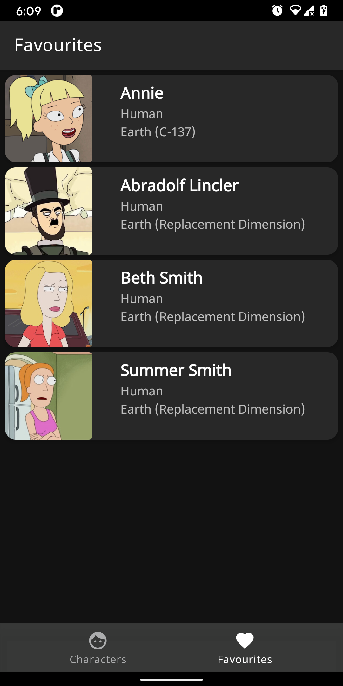

# Rick and Morty app
A simple app that consumes data from the open source [Rick and Morty API service ](https://rickandmortyapi.com) .
This app is based on [android-modular-architecture](https://github.com/VMadalin/android-modular-architecture)
by [VMadalin](https://github.com/VMadalin)

## Dependencies

- [Android Jetpack](https://developer.android.com/jetpack)
- [Material Components](http://material.io)
- [DaggerHilt](http://dagger.dev)
- [Timber](http://github.com/JakeWharton/timber)
- [Junit5](http://junit.org)
- [Espresso]()
- [Coil](http://coil-kt.github.io)
- [Mockito](http://site.mockito.org)
- [Mockk](http://mockk.io)
- [Truth](http://truth.dev)

